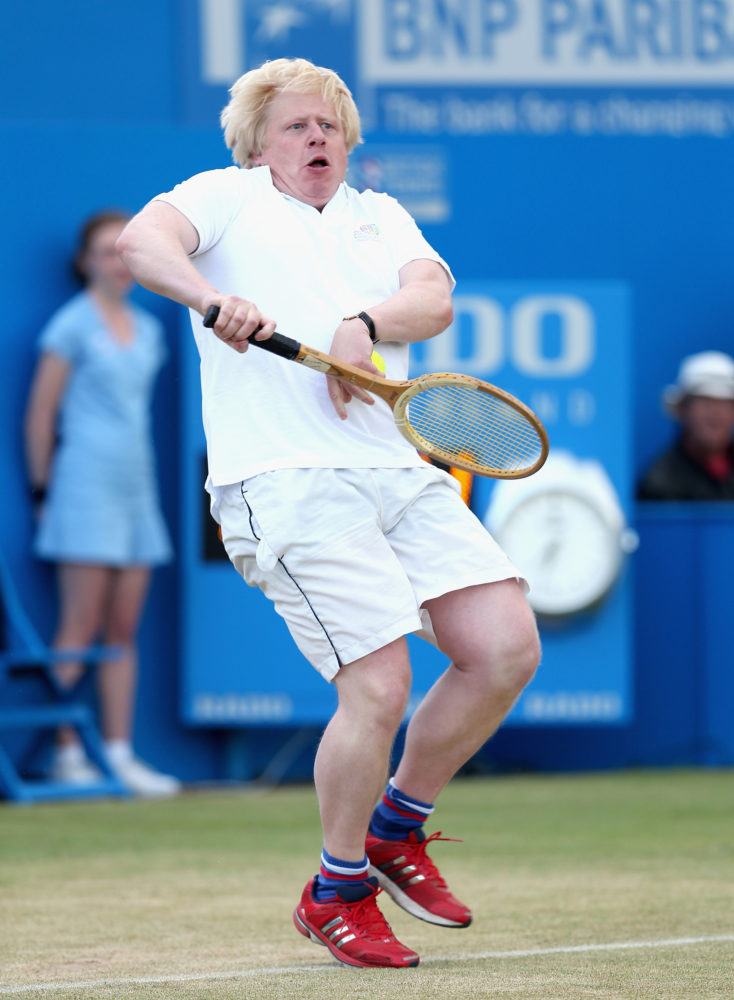
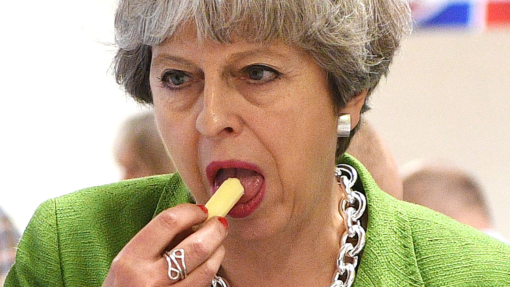
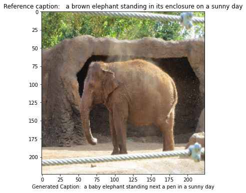

# Show and Tell

Implementation of "Show and Tell: A Neural Image Caption Generator"

# TLDR
So, basically, We use a pretrained Convolutional neural network to encode an image and feed it into an LSTM to generate sentences

# How it works
We used a pretrained CNN to encode an Image then use that as the hidden state of the first LSTM cell. The output of this first cell is ignored. The first cell is only used as sort of an **encoder**. Subsequent words are generated by using the prediction from the previous LSTM cell as input. 


where **I** represents the input Image

**W^e** represents the word embedding

**S^t** represents the current word

## Network Architecture


From the paper, it was verified that feeding the images at every timestep results to inferior results.

The objective is to maximize the **log likelihood** of the sentence given the image so we use negative likelihood loss


# Training the model
## Steps to get started
1. cd into `/scripts`
2. `chmod +x *.sh`
3. `./setup.sh`
4. `./download_data.sh`
5. `./start_python_server.sh` (optional)
6. `./start_tensorboard.sh` (optional, should --logdir depending on where the logs are saved)
7. `./train_{encoder}_{decoder}.sh`

    `./train_vgg_lstm.sh`

## Inference
1. cd into `src`
2. `python predict.py --image {image_path} --encoder {encoder_name} --decoder {decoder_name} --checkpoint {checkpoint}`

    `python predict.py --image doggo.jpg --encoder vgg --decoder lstm --checkpoint 001`

### Training choices
- Used Teacher forcing for faster convergence.

Beam search was not implemented.


## Results

Results on random images from google search (not cherry picked)


```
>>> VGG LSTM (hidden_size 512, embed_size 128)
UNK man in a suit and tie standing in a room EOS
```



```
>>> VGG LSTM (hidden_size 512, embed_size 128)
UNK man holding a tennis racquet on a tennis court EOS
```



```
>>> VGG LSTM (hidden_size 512, embed_size 128)
UNK woman holding a cell phone in her hand EOS
```


```
>>> VGG LSTM (hidden_size 512, embed_size 128)
UNK dog is playing with a frisbee in the grass EOS
```



```
>>> VGG LSTM (hidden_size 512, embed_size 128)
UNK elephants are standing in a dirt field EOS
```